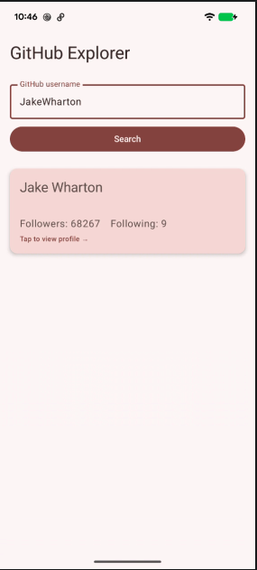
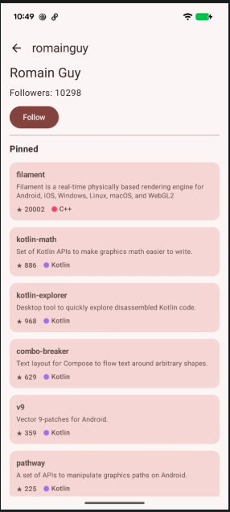

# GraphQLAppAndroid

## Screenshots

|                  Search Screen                  |                       Profile Screen                        |
|:-----------------------------------------------:|:-----------------------------------------------------------:|
|  |  |

## Step 1 of 8 — Add Apollo Kotlin to the build files
- 1a. gradle/libs.versions.toml
- 1b. app/build.gradle.kts
  Add the Apollo plugin at the top of the plugins {} block:
  Add buildConfig = true inside the existing buildFeatures {} block:
  Add a buildConfigField for the GitHub token inside defaultConfig {}:
  Add an apollo {} block after the android {} block (same indentation level):
  Add the new dependencies inside dependencies {}:
- 1c. local.properties
  Add your GitHub Personal Access Token at the bottom of the file (this file is already in .gitignore so it won't be committed):
  GITHUB_TOKEN=ghp_yourTokenHere 
  - Why a PAT? GitHub's GraphQL API v4 requires authentication for every request — unlike REST v3 which allows some anonymous calls. Go to GitHub → Settings → Developer settings → Personal access tokens → Generate new token. You need scopes: read:user and user:follow.
  - Why buildConfigField? The token is a secret. We read it from local.properties (which is git-ignored) into a Gradle property, then bake it into BuildConfig at compile time. This way the token never appears in source code or in git history, but your app can read it at runtime as BuildConfig.GITHUB_TOKEN.

## Step 2 of 8 — Download the GitHub GraphQL Schema
- First, create the graphql source directory
In your project, create this folder: app/src/main/graphql/
You can do this in Android Studio: right-click app/src/main → New → Directory → type graphql.

- Then run this command in the terminal from the root of your project:
  - ./gradlew downloadGithubApolloSchemaFromIntrospection 

- What this does: Apollo sends the special __schema introspection query to https://api.github.com/graphql using your PAT from local.properties. GitHub responds with its entire schema definition — every type, query, mutation, and field it supports. Apollo saves that to app/src/main/graphql/schema.graphqls.
- Why this matters: This is what makes GraphQL fundamentally different from REST. With REST you'd read the API docs and manually write model classes hoping they match. Here, you download the machine-readable contract and Apollo uses it to validate every query you write at compile time — if you reference a field that doesn't exist, it's a build error, not a runtime crash.

## Step 3 of 8 — Write the GraphQL files
This is the heart of how GraphQL works. You write .graphql files that describe exactly what data you want — Apollo reads them, validates them against the schema you just downloaded, and generates type-safe Kotlin classes at compile time.

Create these 4 files inside app/src/main/graphql/:
- File 1 — RepoFields.graphql (the shared fragment)
- File 2 - SearchUser.graphql
- File 3 - GetUserProfile.graphql
- File 4 - FollowUser.graphql

## Step 4 of 8 — Apollo Client Singleton
Create a new file at:
app/src/main/java/com/android/mr/githubexplorer/network/ApolloClient.kt
package com.android.mr.githubexplorer.network
```kotlin
val apolloClient: ApolloClient = ApolloClient.Builder()
    .serverUrl("https://api.github.com/graphql")
    .addHttpHeader("Authorization", "Bearer ${BuildConfig.GITHUB_TOKEN}")
    .build()
```

## Step 5 of 8 - Search Screen
Two files to create, = SerachViewModel and SearchScreen
- app/src/main/java/com/android/mr/githubexplorer/ui/search/SearchViewModel.kt
- app/src/main/java/com/android/mr/githubexplorer/ui/search/SearchScreen.kt

Add one dependency
- In libs.versions.toml, add under [libraries]:
androidx-lifecycle-runtime-compose = { group = "androidx.lifecycle", name = "lifecycle-runtime-compose", version.ref = "lifecycleRuntimeKtx" }
- In app/build.gradle.kts, add to dependencies {}:
implementation(libs.androidx.lifecycle.runtime.compose)
- This gives us collectAsStateWithLifecycle() — the correct way to collect a StateFlow in Compose. It automatically stops collecting when the screen goes to the background, saving resources.

## Step 6 of 8 - Profile Screen
3 parts:
- Part A: Update GetUserProfile.graphql

The query is missing login, name, and followers on the user. Add them. A great example of how easy it is to add fields in GraphQL.

- Part B - ui/profile/ProfileViewModel.kt
  
Create at: app/src/main/java/com/android/mr/githubexplorer/ui/profile/ProfileViewModel.kt

- Part C - ui/profile/ProfileScreen.kt
  
Create at: app/src/main/java/com/android/mr/githubexplorer/ui/profile/ProfileScreen.kt

## Step 7 of 8
2 files:
- navigation/AppNavigation.kt
  - route to SearchScreen
  - route to ProfileScreen with loginID
- MainActivity.kt
  - Replace contents of MainActivity.kt with call to AppNavigation()

Add INTERNET permission in AndroidManifest.xml just before <application> tag
- \<uses-permission android:name="android.permission.INTERNET"\/>

## Step 8 of 8
Verification & the "Aha Moment"
- 8a. Watch the network traffic

This is the most important step. Open Android Studio → App Inspection → Network Inspector (or use Charles Proxy / adb logcat), then:
  - Search for JakeWharton
  - Tap through to his profile 
  - Tap "Load more"
  - Tap "Follow"
  
  Observe for every single one of those actions:
  - One HTTP POST to https://api.github.com/graphql — not GET, always POST
  - The request body contains a query field with exactly the fields asked for

The response body contains exactly those fields — nothing more
This is the GraphQL contract in action. Compare that to what a REST call would look like — GET /users/JakeWharton returns ~40 fields whether you want them or not.

- 8b. Confirm the five concepts are working end-to-end

| Concept             | How to verify                                                                                                                                                                  |
|:--------------------|:-------------------------------------------------------------------------------------------------------------------------------------------------------------------------------|
| Query + variables   | Search screen → type a login → result appears. Apollo sent $login as a variable in the POST body, not interpolated into the query string                                       |
| Fragment reuse      | Both pinned repos and the repo list show the same fields (name, stars, language). That's one RepoFields fragment serving both                                                  |
| Cursor pagination   | On JakeWharton's profile, tap "Load more" — new repos append to the list. Check Network Inspector: the second request has after: "..." with the cursor from the first response |
| Mutation            | Tap Follow on any user. The button state flips immediately. No second network request fires to refresh the count — Apollo updated it from the mutation response                |
| Compile-time safety | Open SearchUser.graphql, rename avatarUrl to avatarUrll (typo). Build → it fails with a schema error, not a runtime crash                                                      |

- 8c. GraphQL app vs. the equivalent REST app

| This GraphQL app                                          | Equivalent REST app                |
|:----------------------------------------------------------|:-----------------------------------|
| **Model classes**: Zero — Apollo generated them           | Written by hand                    |
| **Over-fetching**: Never — you declared every field       | Always — REST returns full objects |
| **Schema contract**: Enforced at compile time             | Docs + hope                        |
| **Pagination**: Relay cursor spec, type-safe              | Custom per-endpoint                |
| **Mutation + cache sync**: Automatic via normalized cache | Manual state refresh               |

